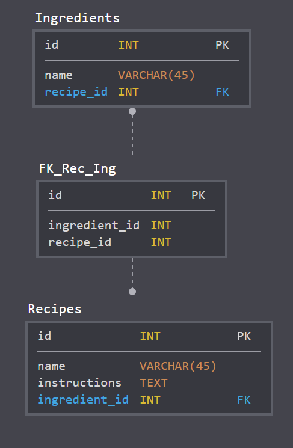

# chef-bot
**Discord Bot poskytující recepty na základě zadaných ingrediencí**

 
 

## Funkční specifikace
* Cílem je vytvořit program, který se napojuje na komunikační platformu Discord a na základě vstupu od uživatele bude vracet recepty jídel
* Vstupem bude seznam ingrediencí, které má uživatel dostupné
* Výstupem bude recept (pokud bude více receptů vyhovovat uživatelskému vstupu, tak program náhodně vylosuje jeden)
* Uživatel také může zažádat o zcela náhodný recept bez toho, aniž by zadal ingredience.
* Uživatel může zažádat o konkrétní recept

## Technická specifikace
### Datový model
* Testovaní bude probíhat na lokální databázi.
* Produkční databáze bude na hostingu nebo Azure.
* Přidávání receptů bude probíhat přes REST API databáze.

### Vývoj 
* Programování bota pomocí knihovny Discord.js pro interakci s Discord API.
* Server s Node.js, poskytující API databáze receptů.
* DevOps pomocí GitHub a Trello.
