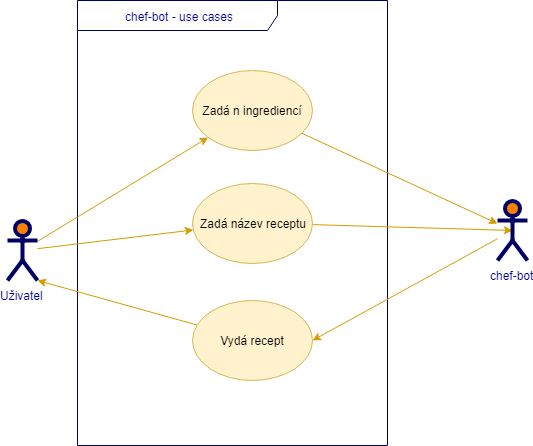
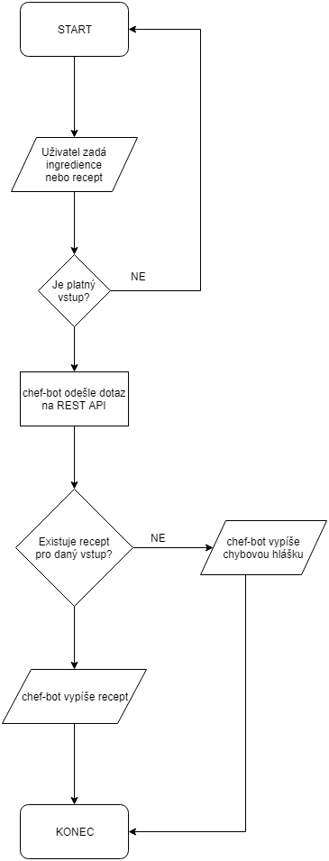
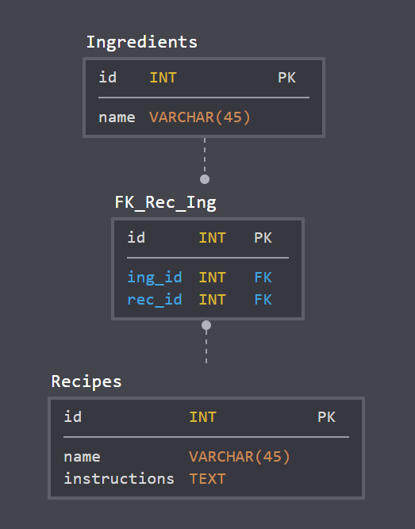

# chef-bot
**chef-bot poskytuje recepty**

 
 

## Tabulka změn
|Datum|Změny|
|---|---|
|30.10.2018|Vypsána první verze dokumentace|
|10.11.2018|Doplněna cílová skupina. Upřesnění role a chování programu v cílové platformě. Doplněny příklady vstupů.|

## Úvod
Cílem tohoto dokumentu je shrnout a specifikovat požadavky a funkce služby chef-bot.\
Vymezuje potřeby zúčastněných stran a cílových uživatelů.

### Cílová skupina
Tato služba je pouze dostupná pro registrované uživatele platformy Discord.

## Funkční specifikace
* Cílem je vytvořit službu, která se napojuje na komunikační platformu [Discord](https://discordapp.com/)
    * Discord je alternativa ke [Skype](https://www.skype.com/) a [Teamspeak](https://www.teamspeak.com/) (aplikace pro hlasovou komunikaci)
* Boti se na platformě tváří jako běžný uživatel s rozdílem, že ještě vedle svého jména mají odznak "BOT"
    * Bot je počítačový program, který automatizovaně komunikuje s lidmi
    * Na platformě Discord je bot schopen krom odpovídání ještě využívat další funkcionality, např. přiřazování rolí a úprava oprávnění pro skupinu či jednotlivce (pokud má oprávnění od správce serveru)
* Uživatel si může bota do svého serveru (nebo na cizím, pokud má daný uživatel dostatečná oprávnění) pozvat pomocí odkazu, který dodá vývojář (nebo na webové stránce pro projekt, pokud existuje)
* Na základě vstupu od uživatele bude vracet recepty jídel
* Vstupem bude seznam ingrediencí, které má uživatel dostupné
    * ingredience musí uživatelé zadávat odděleně čárkou nebo mezerou
    * příklad: "!search ingredience1 ingredience2 ...indredienceN", "!search random", "!search konkretniRecept"
* Výstupem bude recept
    * pokud bude více receptů vyhovovat uživatelskému vstupu, tak program náhodně vylosuje jeden
* Při neplatném vstupu bude uživatel službou informován o neplatném vstupu
    * příklad: "!search neexistujiciIngredience", "!search ingredience1. ingredience2", "!searchingredience1"
* Uživatel také může zažádat o zcela náhodný recept bez toho, aniž by zadal ingredience.
* Uživatel může zažádat o konkrétní recept
* Služba bude poskytována pouze v anglickém jazyce

### Diagram užití

### Vývojový diagram

### Technické požadavky na uživatele
* Koncový uživatel potřebuje k přístupu ke službě zařízení s operačními systémy:
    * Windows (7 nebo vyšší)
    * Linux
    * macOS
    * Android
    * iOS
* Discord je dostupný jak ve verzi webové aplikace, kde uživatel potřebuje pouze prohlížeč a nebo také jako desktopová či mobilní aplikace

## Technická specifikace
### Datový model
* Testovaní bude probíhat na lokální databázi.
* Produkční databáze bude na hostingu nebo Azure.
* Přidávání receptů bude probíhat přes REST API databáze.

### Technické požadavky pro vývoj
* Aplikace Discord
* Discord.js knihovna pro interakci s Discord API.
* Server s Node.js, poskytující rozhraní API k databázi receptů.
* DevOps pomocí GitHub a Trello.
* Relační databáze

### Použité technologie, licence
* Discord ([Proprietární freeware](https://discordapp.com/licenses))
* Discord.js ([Apache License 2.0](https://www.apache.org/licenses/LICENSE-2.0))
* node.js ([MIT License](https://opensource.org/licenses/MIT))
* MySQL ([GNU GPL](https://www.gnu.org/licenses/gpl.html))
