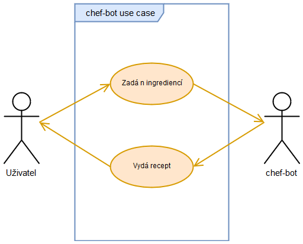

# chef-bot
**chef-bot poskytuje recepty**

 
 

## Tabulka změn
|Datum|Změny|
|---|---|
|30.10.2018|Vypsána první verze dokumentace|
|10.11.2018|Doplněna cílová skupina. Upřesnění role a chování programu v cílové platformě. Doplněny příklady vstupů.|
|23.12.2018|Kontejnerizace aplikace pomocí aplikace Docker|
|5.1.2019|Změněn způsob získávání dat - využita již existující databáze receptů|

## Úvod
Cílem tohoto dokumentu je shrnout a specifikovat požadavky a funkce služby chef-bot.\
Vymezuje potřeby zúčastněných stran a cílových uživatelů.

### Cílová skupina
Tato služba je pouze dostupná pro registrované uživatele platformy Discord.

## Funkční specifikace
* Cílem je vytvořit službu, která se napojuje na komunikační platformu [Discord](https://discordapp.com/)
    * Discord je alternativa ke [Skype](https://www.skype.com/) a [Teamspeak](https://www.teamspeak.com/) (aplikace pro hlasovou komunikaci)
* Boti se na platformě tváří jako běžný uživatel s rozdílem, že ještě vedle svého jména mají odznak "BOT"
    * Bot je počítačový program, který automatizovaně komunikuje s lidmi
    * Na platformě Discord je bot schopen krom odpovídání ještě využívat další funkcionality, např. přiřazování rolí a úprava oprávnění pro skupinu či jednotlivce (pokud má oprávnění od správce serveru)
* Uživatel si může bota do svého serveru (nebo na cizím, pokud má daný uživatel dostatečná oprávnění) pozvat pomocí odkazu, který dodá vývojář (nebo na webové stránce pro projekt, pokud existuje)
* Na základě vstupu od uživatele bude vracet recepty jídel
* Příkazem !info dostane uživatel nápovědu k použití služby
* Vstupem bude seznam ingrediencí, které uživatel vypíše
    * ingredience musí uživatelé zadávat oddělené mezerou
    * příklad: "!recipe ingredience1 ingredience2 indredienceN".
* Výstupem bude recept
    * pokud bude více receptů vyhovovat uživatelskému vstupu, tak služba náhodně vylosuje jeden recept z maximálně pěti dostupných.
    * Recept bude poslán ve zprávě botem a bude obsahovat:
        * Název receptu
        * Odkaz na recept        
        * Výpis ingrediencí
        * Obrázek 
* Při neplatném vstupu bude uživatel službou informován.
    * příklad: "!recipe neexistujiciIngredience"
* Služba bude poskytována pouze v anglickém jazyce

### Diagram užití

### Vývojový diagram

### Technické požadavky na uživatele
* Koncový uživatel potřebuje k přístupu ke službě zařízení s operačními systémy:
    * Windows (7 nebo vyšší)
    * Linux
    * macOS
    * Android
    * iOS
* Discord je dostupný jak ve verzi webové aplikace, kde uživatel potřebuje pouze prohlížeč a nebo také jako desktopová či mobilní aplikace

## Technická specifikace
### Zdroj receptů
* Jakožto databáze receptů je využita již existující služba [edamam](https://www.edamam.com/).

### Technické požadavky pro vývoj
* Aplikace Discord
* Discord.js knihovna pro interakci s Discord API.
* Server s Node.js, poskytující rozhraní API k databázi receptů.
* DevOps pomocí GitHub a Trello.

### Použité technologie, licence
* Discord ([Proprietární freeware](https://discordapp.com/licenses))
* Discord.js ([Apache License 2.0](https://www.apache.org/licenses/LICENSE-2.0))
* node.js ([MIT License](https://opensource.org/licenses/MIT))
* Docker ([Apache License 2.0](https://www.apache.org/licenses/LICENSE-2.0), [GNU GPL](https://www.gnu.org/licenses/gpl.html))

## Disclaimer
* Autoři negarantují neptřetržitý provoz služby chef-bot
* Autoři se zříkají jakékoliv právní zodpovědnosti spojené s použiváním služby chef-bot
* Autoři negarantují esteticky příjemné obrázky